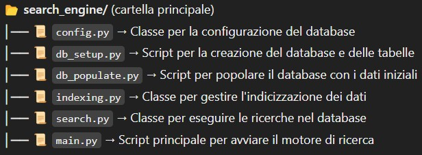

# 🚀 Cose da fare 🚀

Qui inseriamo tutte le cose da fare, un programma da realizzare passo passo:
1. **Configurazione Database 🗄️**
    - [X] Configurare un file .json che contenga tutti i dati di connessione al database 🔐
2. **Divisione del progetto in Moduli 📂**
    - [X] Verificare e modificare gli script affinchè vengano utilizzati più moduli per aveere un ordine generale migliore 🔄
    
3. **Creazione e popolazione del DB 🛠️**
    - [X] Consolidare la funzione per la creazione del database → per la creazione consolidare i tipi di dato che andiamo ad utilizzare nelle colonne della tabella 📊
    - [X] Creazione della funzione di connessione 🔗
    - [ ] Consolidare la funzione per la popolazione del database e controllare che ogni dato rispetti i tipi di dato 🧐
4. **Ricerca e modifica globale del programma 🔍**
    - [X] Stabilire se tenerlo come un modulo di funzioni o creare una Classe (studio dei vantaggi e degli svantaggi) 🧩
    - [X] Passaggio alle classi eseguito 📜
5. **Indicizzazione 🏷️**
    - [ ] Studiare se utilizzare degli indici, se si creare e consolidare la funzione per la creazione di indici 📑
6. **Tokenizzazione 🧠**
    - [ ] Vedere quando applicare l'NLTK al motore di ricerca 📚
    - [ ] Se è il momento creare il tokenizzatore 📝
7. **Search Engines 💡**
    - [ ] Capire il motore di ricerca di Postgres di default (ranking di default) 🤖
    - [ ] Realizzazione del modulo di ricerca per Postgres 🧑‍💻
8. **Testing del motore di ricerca 🧪**
    - [ ] Utilizzare delle query semplici o dei test per testare ogni cosa ✅
    - [ ] Se non eseguito prima. creare il tokenizzatore 🖋️
9. **2° modello di ranking 🏅**
    - [ ] Implementare il secondo modello di ranking 🏆
10. **Query 💬**
    - [ ] Studiare se i due ranking e soprattuto il Search Engine funzioni con le query complesse 💻
11. **Funzionalità aggiuntiva ✨**
    - [ ] Stabilire la funzionalità aggiuntiva 🎯
    - [ ] Realizzare la funzionalità aggiuntiva 🏁
12. **(Bonus) 🎁**
    - [ ] Realizzare e modificare una lieve interfaccia grafica da terminale che faccia vedere una barra di caricamento per la popolazione e la creazione del DB ⏳
